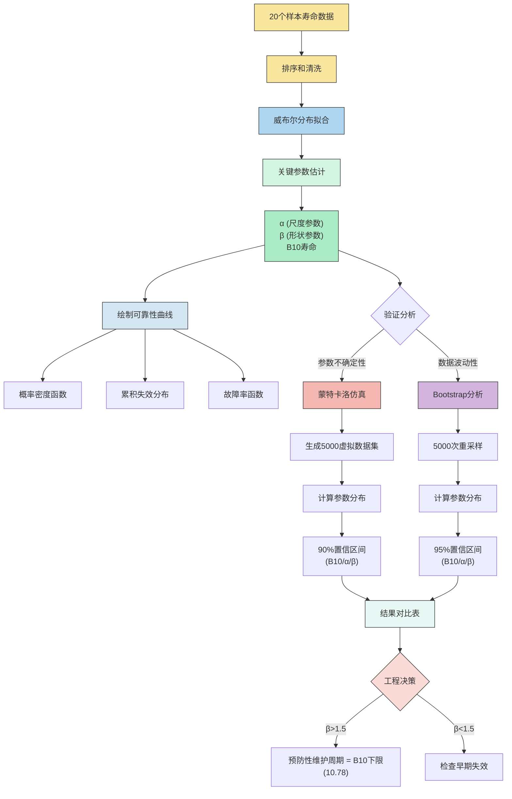
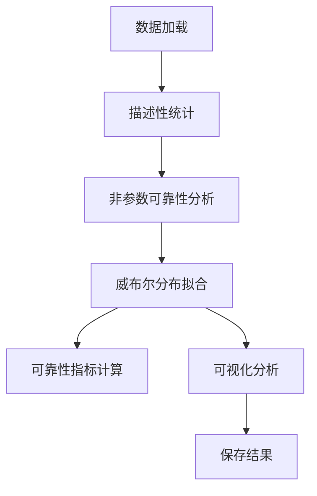

---

### **可靠性分析技术报告**

#### 一、代码结构概述






#### 二、核心详解

1. **数据预处理**
   - 输入格式：`{'组数': [...], '周期': [...]}`
   - 关键操作：
     ```python
     lifetimes = df['周期'].sort_values().values  # 排序后的寿命数据
     ```

2. **描述性统计**
   | 指标 | 计算公式               | 说明             |
   | ---- | ---------------------- | ---------------- |
   | 偏度 | `scipy.stats.skew`     | 数据分布不对称性 |
   | 峰度 | `scipy.stats.kurtosis` | 数据分布尖锐度   |

3. **非参数可靠性分析**
   - **关键函数**：
     ```python
     hazard_rate = prob_failure / last_reliability  # λ(t) = f(t)/R(t-1)
     median_rank = (i - 0.3)/(n + 0.4)  # 中位秩估计
     ```

4. **威布尔分布拟合**
   - 使用`reliability.Fit_Weibull_2P`进行最大似然估计
   - 关键参数：
     - 形状参数β：控制失效模式（β<1: 早期失效；β=1: 随机失效；β>1: 磨损失效）
     - 尺度参数α：特征寿命（63.2%失效时间）

   #### **本质**
   
   1. **直接拟合对象**：
   
      - **原始失效时间数据**（如`lifetimes = [12, 10, 18,...]`）
      - 原理：通过极大似然估计或最小二乘法，直接拟合失效时间的概率分布。
   
   2. **间接指标的关系**：
   
      - 所有其他指标（f(t)、F(t)、R(t)、λ(t)）均可通过威布尔分布的参数（α, β）**派生计算**：
   
        概率密度函数 (PDF)
        $$
        f(t) = \frac{\beta}{\alpha} \left( \frac{t}{\alpha} \right)^{\beta-1} e^{-\left( t/\alpha \right)^\beta}
        $$
   
        累积分布函数 (CDF)
        $$
        F(t) = 1 - e^{-\left( t/\alpha \right)^\beta}
        $$
   
        可靠度函数
        $$
        R(t) = e^{-\left( t/\alpha \right)^\beta}
        $$
   
        故障率函数
        $$
        \lambda(t) = \frac{\beta}{\alpha} \left( \frac{t}{\alpha} \right)^{\beta-1}
        $$
   
        参数说明：
   
        - $\alpha$ (alpha)：尺度参数（特征寿命）
        - $\beta$ (beta)：形状参数
          - $\beta < 1$：早期故障
          - $\beta = 1$：随机故障（指数分布）
          - $\beta > 1$：耗损故障
        - $t$：时间变量
   
5. **可视化系统**
   - **六子图布局**：
     ```python
     plt.subplot(3,2,1)  # f(t)
     plt.subplot(3,2,2)  # λ(t) 
     plt.subplot(3,2,3)  # F(t)
     plt.subplot(3,2,4)  # R(t)
     plt.subplot(3,2,5)  # 中位秩F(t)
     plt.subplot(3,2,6)  # 中位秩R(t)
     ```

#### 三、关键公式与原理

1. **威布尔分布函数**
  
   - 概率密度函数（PDF）：
     $$
     f(t) = \frac{\beta}{\alpha}\left(\frac{t}{\alpha}\right)^{\beta-1}e^{-(t/\alpha)^\beta}
     $$
   - 累积分布函数（CDF）：
     $$
     F(t) = 1 - e^{-(t/\alpha)^\beta}
     $$
   
2. **中位秩估计（Benard公式）**
   $$
   F(t_i) = \frac{i - 0.3}{n + 0.4}
   $$
   
   - 修正小样本偏差，比简单比例\(i/n\)更准确
   
3. **故障率函数**
   $$
   \lambda(t) = \frac{f(t)}{R(t)} = \frac{\beta}{\alpha}\left(\frac{t}{\alpha}\right)^{\beta-1}
   $$

4. **威布尔概率图**
   - 坐标变换：
     $$
     \ln[-\ln(1-F(t))] = \beta\ln(t) - \beta\ln(\alpha)
     $$
   - 拟合线斜率=β，截距=-βln(α)

#### 四、典型输出结果

1. **描述性统计**

   | **统计量** | **样本量** | **平均寿命** | **中位寿命** | **最小寿命** | **最大寿命** | **标准差** | **偏度**   | **峰度**  |
   | ---------- | ---------- | ------------ | ------------ | ------------ | ------------ | ---------- | ---------- | --------- |
   | **值**     | 20         | 15.65        | 15.5         | 10           | 20           | 2.83354    | -0.0189053 | -0.693811 |

   - **关键指标**：涵盖了集中趋势（平均、中位）、离散程度（标准差、极差）和分布形态（偏度、峰度）。
   - **数据解读**：
     - 偏度接近0，说明寿命分布基本对称；
     - 负峰度表明数据分布较正态分布更平坦（低峰态）。

   | **周期 (t)** | **失效数 (d)** | **风险集 (n)** | **f(t)** | **F(t)** | **R(t)** | **λ(t)**  | **中位秩 F(t)** | **中位秩 R(t)** |
   | ------------ | -------------- | -------------- | -------- | -------- | -------- | --------- | --------------- | --------------- |
   | 0            | 10             | 1              | 0.05     | 0.05     | 0.95     | 0.05      | 0.0343137       | 0.965686        |
   | 1            | 12             | 2              | 0.1      | 0.15     | 0.85     | 0.105263  | 0.0833333       | 0.916667        |
   | 2            | 13             | 1              | 0.05     | 0.2      | 0.8      | 0.0588235 | 0.132353        | 0.867647        |
   | 3            | 14             | 3              | 0.15     | 0.35     | 0.65     | 0.1875    | 0.181373        | 0.818627        |
   | 4            | 15             | 3              | 0.15     | 0.5      | 0.5      | 0.230769  | 0.230392        | 0.769608        |
   | 5            | 16             | 3              | 0.15     | 0.65     | 0.35     | 0.3       | 0.279412        | 0.720588        |
   | 6            | 17             | 2              | 0.1      | 0.75     | 0.25     | 0.285714  | 0.328431        | 0.671569        |
   | 7            | 18             | 1              | 0.05     | 0.8      | 0.2      | 0.2       | 0.377451        | 0.622549        |
   | 8            | 19             | 1              | 0.05     | 0.85     | 0.15     | 0.25      | 0.426471        | 0.573529        |
   | 9            | 20             | 3              | 0.15     | 1        | 0        | 1         | 0.47549         | 0.52451         |

   ### **数据解读**：
   - **周期 (t)**：观测的时间点或区间。  
   - **失效数 (d)**：在该周期内发生的失效事件数量。  
   - **风险集 (n)**：在该周期开始时尚未失效的样本数（即“风险集”大小）。  
   - **f(t)**：失效概率密度（失效数 / 初始样本总数）。  
   - **F(t)**：累积失效概率
     $$
     F(t) = \sum f(t)
     $$
   - **R(t)**：可靠度
     $$
     R(t) = 1 - F(t)
     $$
   - **λ(t)**：风险率
     $$
     \lambda(t) = \frac{f(t)}{R(t)}
     $$
   - **中位秩 F(t)**：基于Bernard公式 
     $$
     中位秩F(t)=\frac{i-0.3}{n+0.4}
     $$
      计算的累积失效概率中位秩估计。  
   - **中位秩 R(t)**：可靠度的中位秩估计
     $$
     中位秩R(t)=1 - \text{中位秩 } F(t)
     $$

2. **周期数据威布尔拟合结果**

   

   ```
   形状参数β=6.37, 尺度参数α=16.81
   ```

3. **可视化效果**

   

   - 六子图对比：
     
     
   - 周期数据威布尔概率图：

     **威布尔概率图**：观察数据点与理论直线的偏离

     ```python
     weibull_fit.plot()  # 线性度越好，拟合越合理
     ```

     

   - **统计检验**（如K-S检验）：

     ```python
     from scipy.stats import kstest
     D, p = kstest(lifetimes, lambda x: 1 - np.exp(-(x/alpha)**beta))
     print(f"K-S检验p值={p:.3f} (p>0.05接受威布尔假设)")
     ```

​			

- **关键可靠性指标**

|        | **B₁₀寿命(10%失效)** | **B₅₀寿命(中位寿命)** | **特征寿命(α)** | **形状参数(β)** |
| ------ | -------------------- | --------------------- | --------------- | --------------- |
| **值** | 11.8095              | 15.8705               | 16.8098         | 6.37395         |

- **B₁₀寿命**：10%产品发生失效的时间（11.8095）
  $$
  t_{0.1} = \alpha \cdot (-\ln(1-0.1))^{1/\beta} = \alpha \cdot (-\ln 0.9)^{1/\beta}
  $$

- **B₅₀寿命**：50%产品发生失效的时间（中位寿命，15.8705）
  $$
  t_{0.5} = \alpha \cdot (-\ln 0.5)^{1/\beta} = \alpha \cdot (\ln 2)^{1/\beta}
  $$

- **特征寿命(α)**：威布尔分布尺度参数（63.2%失效概率对应的时间，16.8098）
  $$
  \alpha = t \ \text{||} \ F(t)=1-e^{-1} \approx 0.632 \ \text{时的寿命值}
  $$
  
- **形状参数(β)**：威布尔分布形状参数（6.37395，β>1表示耗损型失效模式）
  $$
  \beta \ \text{通过威布尔概率图或最大似然估计求得}
  $$

#### 五、工程应用建议

1. **数据要求**
   - 最小样本量：≥5个失效数据
   - 记录完整的失效时间

2. **结果解读**
   - β>1：磨损失效主导，建议预防性维护
   - B10寿命：10%产品失效时间，关键维护节点

3. **注意事项**
   - 中位秩适用于小样本（n<20）
   - 威布尔假设需通过概率图验证

#### 六、扩展改进方向

**蒙特卡洛仿真+Bootstrap重采样**

蒙特卡洛仿真（Monte Carlo Simulation）是一种通过**随机抽样**和**统计计算**来模拟复杂系统或解决数学问题的计算方法。其核心思想是通过生成大量随机样本，利用概率统计原理获得问题的近似解。

- 基于拟合参数生成虚拟数据集
- 重复1000次得到参数分布


Bootstrap重采样1000次


##### 结果对比表
| 指标          | 蒙特卡洛仿真 (90% CI) | Bootstrap (95% CI) | 原始点估计 |
| ------------- | --------------------- | ------------------ | ---------- |
| **B10寿命**   | [10.36 13.51]         | [10.38, 13.66]     | 11.81      |
| **尺度参数α** | [15.75, 17.79]        | [15.46, 18.01]     | 16.81      |
| **形状参数β** | [5.03, 9.19]          | [5.22, 8.93]       | 6.37       |


**可靠性决策**：
   - 以Bootstrap的95%置信区间为准，B10寿命有95%概率在[10.38, 13.66]周期之间
   - 建议预防性维护时间设为**10.38周期**（保守估计）


#### **七、遇到的问题**

1. **疑问**：是否需要分别拟合F(t)、R(t)、λ(t)？  
   **答案**：❌ 不需要！这些均从同一组(α,β)派生，重复拟合会导致矛盾结果。

   ##### 为什么不能直接拟合间接指标？

   | 指标     | 直接拟合的问题                               |
   | -------- | -------------------------------------------- |
   | **f(t)** | 概率密度是连续函数，离散经验值拟合会引入误差 |
   | **F(t)** | 中位秩估计已是非参数近似，再拟合会叠加误差   |
   | **λ(t)** | 故障率依赖前序R(t)计算，累积误差放大         |
   | **R(t)** | 与F(t)完全共轭（R=1-F），无额外信息          |

2. **疑问**：中位秩F(t)能否用于拟合？  
   **答案**：仅用于绘制概率图，不能作为拟合输入（因其本身是估计值）。

3. **疑问**：样本少时能否拟合？  
   **答案**：n=20是可接受的最小样本量，但需增加置信区间分析

   

---

